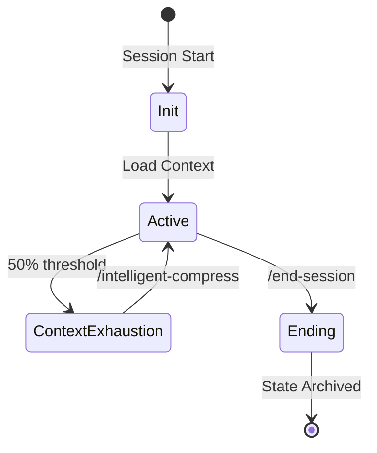

# OpenClaw Design Philosophy Report

**Date**: 2026-02-05  
**Scope**: Deep analysis of OpenClaw's architectural excellence, automation philosophy, and reliability engineering  
**Repository**: https://github.com/openclaw/openclaw  
**Version Analyzed**: 2026.2.x series  

---

## Executive Summary

OpenClaw (formerly ClawdBot/Moltbot) represents a landmark achievement in autonomous AI agent architecture, achieving 164K+ GitHub stars through exceptional engineering discipline. Created by Peter Steinberger in late 2025, the project demonstrates that **reliability at scale comes from principled constraints, not unbounded capability**.

### Core Design Principles

1. **Default Serial, Explicit Parallel**: Prevent state corruption by making concurrency opt-in
2. **Local-First Control Plane**: Single WebSocket Gateway owns all channels and state
3. **Hybrid Memory**: Combine JSONL audit trails with Markdown long-term knowledge
4. **Strict Schema Validation**: Gateway refuses to start on invalid config
5. **Session Isolation**: Each conversation lane operates independently
6. **Transparent Observability**: Every tool call, token, and cost tracked

### Why OpenClaw Excels

OpenClaw's excellence stems from **architectural restraint**—the deliberate choice to constrain parallelism, enforce schemas, and maintain single-writer patterns. This creates a system that is **debuggable, auditable, and predictable** even under autonomous operation.

The project proves that a 40,000-line TypeScript codebase can achieve production-grade reliability when guided by clear architectural invariants.

---

## Architectural Mastery

### Gateway Design: The Control Plane Pattern

OpenClaw's Gateway is the cornerstone of its architecture—a single long-running WebSocket server that acts as **air traffic control** for the entire AI assistant.

#### Design Philosophy

- **Single Writer, Multiple Reader**: Only the Gateway modifies state; clients observe via WebSocket events
- **Loopback-First**: Default bind is `127.0.0.1:18789` for security-by-default
- **Typed WebSocket API**: All frames validated against JSON Schema before processing
- **Event-Driven**: Emits lifecycle events (`agent`, `chat`, `presence`, `health`, `heartbeat`, `cron`)

#### Why This Works

Traditional multi-process architectures create **resource contention** and **state synchronization** problems. OpenClaw's Gateway pattern eliminates these by centralizing all channel management. One Gateway per host means:

- No race conditions between competing processes
- Single source of truth for WhatsApp/Telegram/Slack connections
- Simplified deployment (one process to monitor)
- Clear failure domain (if Gateway crashes, everything fails cleanly)

**Jarvis Implication**: The Gateway pattern demonstrates that **centralization can be a feature, not a bug** when building autonomous agents. Jarvis should consider a similar control plane for coordinating multiple tools and skills.

### Component Decoupling: Extension Points

OpenClaw achieves extensibility through **four well-defined integration slots**:

| Slot | Purpose | Example |
|------|---------|---------|
| **Channels** | Messaging platform integrations | WhatsApp, Telegram, Discord, Slack |
| **Tools** | Agent capabilities | Shell, FileSystem, Browser, Gmail |
| **Providers** | AI model inference | Anthropic, OpenAI, Groq, Ollama |
| **Memory** | Search backends | SQLite FTS5 + vector embeddings |

#### Plugin Architecture

The Plugin Loader scans `extensions/` and discovers plugins via `package.json` manifests. Each plugin:

1. Declares a **TypeBox schema** for configuration validation
2. Maps to one of the four integration slots
3. Gets registered in the Plugin Registry
4. Exposes type-safe config in `openclaw.json`

**Design Strength**: Plugins are **discovered, not hardcoded**. The Gateway doesn't need to know about specific extensions—it only needs to understand the four integration slots.

**Trade-off**: This openness creates **supply chain risk**. Malicious or poorly audited plugins can execute arbitrary code. OpenClaw's 2026.1.29 release added sandboxing to mitigate this.

### Extension Philosophy: Open/Closed Principle

OpenClaw is **open for extension, closed for modification**. The core Gateway logic remains stable while the ecosystem grows through:

- **ClawHub**: Public skills registry with 3,000+ community skills
- **SKILL.md standard**: Declarative skill definition format
- **Workspace isolation**: Skills scoped to agent/session/workspace boundaries

**Critical Insight**: OpenClaw demonstrates that **extensibility requires guardrails**. Skills run in isolated sandboxes with granular permissions. Users approve each permission explicitly.

**Jarvis Lesson**: Jarvis's skills system should adopt similar sandboxing and permission models. The current `~/.claude/skills/` directory lacks isolation.

---

## Automation Excellence

### Autonomous Operation: The Lane Architecture

OpenClaw's automation philosophy is captured in one phrase: **"Default Serial, Explicit Parallel"**.

#### The Problem Being Solved

Uncontrolled asynchronous agent execution creates:

- **State corruption**: Two tasks modify the same file simultaneously
- **Log chaos**: Interleaved logs from parallel tasks become unreadable
- **Race conditions**: Non-deterministic failures that are hard to reproduce

#### The Solution: Lane-Based Concurrency

Each **session** (conversation context) gets its own **lane** (execution queue). By default:

- Tasks within a lane execute **serially** (one after another)
- Tasks across lanes execute **in parallel** (controlled by global parallelism cap)
- Only **idempotent or low-risk** tasks (scheduled checks) move to parallel lanes

```
Lane Architecture Visualization:

Session 1 (Main):    [Task A] → [Task B] → [Task C]
Session 2 (Cron):    [Task X] → [Task Y]
Session 3 (Group):   [Task M]

Global Parallelism Cap: 4 concurrent lanes
```

#### Why This Works

**Benefits**:
- Failures are **isolated** to a single lane
- Logs remain **readable** (one task's output doesn't interleave with another's)
- State corruption is **prevented** (only one task touches a session at a time)
- Maintenance cost is **lowered** (deterministic execution simplifies debugging)

**Trade-offs**:
- Longer latency for non-parallel tasks
- Manual opt-in required for parallelism (adds friction)

**Architectural Guarantee**: "Only one agent run touches a given conversation at a time" is an **invariant** enforced by the lane queue.

**Jarvis Comparison**: Jarvis lacks explicit concurrency control. The Wiggum Loop executes tasks serially, but there's no formal lane architecture. Adopting this pattern would improve predictability.

### Autonomous Decision Boundaries

OpenClaw defines **clear boundaries** between autonomous and human-gated operations:

#### Autonomous (No Confirmation Required)

- Reading files, browsing web pages
- Searching memory, querying databases
- Scheduling cron jobs (within configured limits)
- Sending messages to approved channels

#### Human-Gated (Confirmation Required)

- Executing shell commands (unless allowlisted)
- Writing to file system (unless sandboxed)
- Deleting data, force-pushing git
- Installing skills from ClawHub

**Configuration**: The `agents.defaults.sandbox` setting controls this boundary:

```json
{
  "agents": {
    "defaults": {
      "sandbox": {
        "scope": "agent",  // "agent" | "session" | "global"
        "workspace": "none"  // "none" | "ro" | "rw"
      }
    }
  }
}
```

**Jarvis Lesson**: Jarvis should formalize similar boundaries. The current system relies on implicit trust. Adding explicit sandboxing for file operations and shell commands would increase safety.

### Recovery Mechanisms: Self-Healing

OpenClaw implements several **autonomic recovery** patterns:

#### 1. Auto-Compaction on Context Overflow

**Problem**: LLM context window exceeded during conversation.

**Recovery Flow**:
1. Model returns `token_limit_exceeded` error
2. System triggers auto-compaction (summarizes history)
3. **Pre-compaction memory flush**: Writes key facts to `memory/YYYY-MM-DD.md`
4. Original request is retried with compacted context

**Critical Design**: The memory flush ensures **continuity**. Without it, context compression would lose important information.

#### 2. Model Failover with Retry

**Problem**: Primary model unavailable or rate-limited.

**Recovery Flow**:
1. Primary provider returns 429 (rate limit) or 503 (overloaded)
2. System attempts **fallback provider** (e.g., OpenAI → Anthropic)
3. If fallback succeeds, continue; if not, apply **exponential backoff**
4. Retry original provider after delay

**Configuration**: Providers support `retry-after` header parsing for intelligent backoff.

**Known Issue**: GitHub issue #5159 documents aggressive retry loops that hammer APIs. This indicates recovery logic needs refinement.

#### 3. Session Pruning

**Problem**: Long-lived "main" session accumulates too much context.

**Recovery**: OpenClaw supports `/new` command to prune session and start fresh while preserving long-term memory.

**Limitation**: As of 2026, agents have **no visibility** into their context window usage. They can't proactively trigger compaction.

**Jarvis Comparison**: JICM (Jarvis Intelligent Context Management) is more sophisticated—it monitors token usage and triggers `/intelligent-compress` at 50% threshold. This is an area where **Jarvis excels**.

---

## Reliability Engineering

### Failure Handling: Systematic Error Management

OpenClaw's approach to errors reveals its engineering maturity:

#### Error Categorization

| Error Type | Response Strategy |
|------------|-------------------|
| **Transient** (429, 503) | Retry with exponential backoff + fallback |
| **Permanent** (401, 403) | Fail fast, log error, notify user |
| **Context Overflow** | Auto-compact + memory flush + retry |
| **Config Validation** | Refuse to start Gateway (fail safe) |
| **Hook Failure** | Isolate (don't crash Gateway) |

#### Failure Isolation

**Design Principle**: Individual component failures should **not cascade** to the entire system.

**Implementation**:
- Hook execution failures are **caught and logged** but don't crash Gateway
- Channel connection drops trigger **reconnection logic** without affecting other channels
- Tool execution errors are **surfaced to agent** but don't halt session

**Known Weakness**: GitHub issue #3815 documents Gateway crashes from **unhandled promise rejections** in network failures. This violates the isolation principle and needs fixing.

### Race Condition Prevention

OpenClaw has struggled with concurrency bugs—a testament to how **hard distributed systems are**:

#### Documented Race Conditions

1. **TUI Heisenbug** (Issue #549): WebSocket race causes responses to drop unless logs are watched
2. **Announce Failover Race** (Fixed in 2026.2.1): Lifecycle events not always emitted
3. **Buffer Timestamp Corruption** (Issue #1796): Unprotected concurrent access in `ChatRunState`
4. **ISO 8601 Formatter** (Fixed in 2026.2.3): macOS concurrency safety issue

#### Prevention Strategies

**Lane Queue**: The primary defense—serial execution by default prevents most races.

**Single-Writer Pattern**: Only Gateway modifies state; clients read via events.

**TypeScript Async/Await**: Explicit async control (vs. Python's asyncio callback hell).

**Limitation**: These patterns **reduce** race conditions but don't eliminate them. Async I/O (WebSocket, file system) still creates opportunities for races.

**Jarvis Comparison**: Jarvis operates in a simpler concurrency model (single-threaded Python-like execution in Claude). Races are less common but can still occur in multi-tool scenarios.

### Data Consistency: Audit Trails

OpenClaw's memory system prioritizes **auditability** over performance:

#### JSONL Session Transcripts

Every conversation turn is **append-only** to a JSONL file:

```jsonl
{"type":"user","content":"Schedule meeting for tomorrow","timestamp":"2026-02-05T10:00:00Z"}
{"type":"assistant","content":"I'll schedule that for you.","timestamp":"2026-02-05T10:00:03Z"}
{"type":"tool","name":"calendar.create","timestamp":"2026-02-05T10:00:05Z"}
```

**Benefits**:
- **Tamper-proof**: Append-only files are harder to manipulate
- **Time-travel debugging**: Replay any session from JSONL
- **Low-level audit**: Every tool call and LLM request logged

**Trade-off**: JSONL grows unbounded (requires compaction).

#### Markdown Memory Files

Long-term knowledge is **human-readable Markdown**:

```markdown
# 2026-02-05

## Project Aion
- Completed JICM v5.4.2 with statusline improvements
- Fixed poll_count double-increment bug in watcher

## Meetings
- Scheduled 1:1 with Sarah for tomorrow 2pm
```

**Benefits**:
- **Editable**: Users can correct or augment agent memory
- **Portable**: Plain text, no database lock-in
- **Transparent**: Users see exactly what agent "remembers"

**Design Choice**: Files are **source of truth**. The model only "remembers" what's written to disk. This prevents hallucination of past events.

**Jarvis Comparison**: Jarvis uses Memory MCP for structured knowledge storage. The Markdown approach is simpler and more transparent, but less queryable.

### Observability: Built-In Monitoring

OpenClaw treats observability as a **first-class concern**:

#### Token and Cost Tracking

Every agent response includes:
- **Token usage** (input + output)
- **API cost** (calculated from provider pricing)
- **Model used** (e.g., `claude-opus-4-5`)

Users see exactly **how much each conversation costs**.

**Critical Feature**: This prevents runaway costs. Users discovered agents burning **hundreds of dollars per day** in early testing.

#### Verbose Mode

`verbose: true` enables:
- Full tool call JSON
- LLM reasoning traces
- Intermediate steps in multi-turn tasks

**Use Case**: Debugging hallucinations or unexpected behavior.

#### Logging and SIEM Integration

The `openclaw-detect` tool (third-party) provides:
- Capture of every tool call and LLM request
- Built-in redaction (removes credentials)
- Tamper-proof hash chains
- Syslog/SIEM forwarding for enterprise monitoring

**Jarvis Comparison**: Jarvis logs to `.claude/logs/` but lacks structured observability. Adding token/cost tracking and SIEM integration would improve production readiness.

---

## Predictability Design

### Configuration Schema: Fail-Safe Validation

OpenClaw's configuration system is **unforgiving by design**:

#### Schema Enforcement

The Gateway **refuses to start** if `openclaw.json` contains:
- Unknown keys
- Malformed types (e.g., string where number expected)
- Invalid values (e.g., negative timeout)

**Rationale**: A misconfigured agent is **dangerous**. Better to fail at startup than execute with incorrect settings.

**User Experience**: Validation failures show **precise error messages**:

```
Config validation failed:
  - agents.defaults.sandbox.scope: must be one of ["agent", "session", "global"]
  - gateway.bind.port: must be a positive integer
```

**Critical Insight**: This is **defensive engineering**. The system assumes users will make mistakes and protects against them.

#### JSON Schema Export

The Gateway exposes a **JSON Schema** representation of the config via `config.schema`. This enables:

- **IDE autocomplete**: VSCode can validate `openclaw.json` as you type
- **UI form generation**: Control UI renders form from schema
- **Documentation**: Schema is self-documenting

**Jarvis Lesson**: Jarvis should adopt schema validation for `CLAUDE.md` and `.claude/context/session-state.md`. Currently these rely on conventions, not enforcement.

### State Machines: Explicit Transitions

OpenClaw models agent behavior as **explicit state machines**:

#### Session Lifecycle States

```
[Created] → [Active] → [Compacting] → [Active] → [Pruned]
                ↓           ↓
           [Errored] → [Recovering]
```

**Transitions**:
- `Created → Active`: First message received
- `Active → Compacting`: Context overflow detected
- `Compacting → Active`: Compaction succeeded
- `Active → Pruned`: User invoked `/new`
- `* → Errored`: Unrecoverable failure
- `Errored → Recovering`: Retry attempted

**Benefit**: State transitions are **logged and observable**. Debugging "why did the agent reset?" becomes trivial.

**Jarvis Comparison**: Jarvis has implicit state (session start, working, idle, ending) but lacks formal state machine representation.

### Invariant Enforcement

OpenClaw maintains several **architectural invariants** that are never violated:

#### Invariant 1: One Gateway per Host

**Rule**: Only one Gateway process can bind to a host. WhatsApp session is unique to the Gateway.

**Enforcement**: Gateway writes PID file on startup. If file exists, check if process is running. If yes, refuse to start.

**Why**: WhatsApp Web session is single-device. Multiple Gateways would conflict.

#### Invariant 2: Session-Lane Isolation

**Rule**: Only one agent run touches a given session at a time.

**Enforcement**: Lane queue serializes tasks per session key.

**Why**: Prevents state corruption from concurrent modifications.

#### Invariant 3: Config Immutability During Run

**Rule**: Config changes require Gateway restart.

**Enforcement**: `config.apply` and `config.patch` write restart sentinel and trigger restart.

**Why**: Hot-reloading complex config is error-prone. Restart provides clean state.

**Jarvis Lesson**: Jarvis should formalize invariants and document them in `context/psyche/`. Current system has implicit rules that aren't enforced.

---

## Skills Architecture

### 3-Tier Design Rationale

OpenClaw organizes skills into **three tiers** based on trust and scope:

| Tier | Location | Trust Level | Scope |
|------|----------|-------------|-------|
| **Bundled** | Built into OpenClaw | Highest (maintainer-reviewed) | Global (all agents) |
| **Managed** | Installed from ClawHub | Medium (community-vetted) | Workspace (user-controlled) |
| **Workspace** | Local `~/.openclaw/workspace/skills/` | Low (user-created) | Agent/Session (isolated) |

#### Design Rationale

**Problem**: Skills extend agent capabilities but also increase attack surface.

**Solution**: Tiered trust model with **install gating**:

1. **Bundled skills**: Shipped with OpenClaw, no install needed (e.g., `shell`, `filesystem`)
2. **Managed skills**: Discoverable via ClawHub but require **explicit user approval** to install
3. **Workspace skills**: User-created, require **permission declarations**

**Permission System** (added in 2026.1.30):

- Skills declare what they need (`fs:read`, `net:http`, `shell:exec`)
- Users approve or deny each permission
- Denied permissions prevent skill from running

**Critical Insight**: This mirrors **mobile app permission models** (iOS/Android). Proven pattern for balancing capability and safety.

### Discovery Mechanism: Auto-Loading

Skills are **discovered automatically** without hardcoding:

#### Discovery Flow

1. Gateway scans `~/.openclaw/workspace/skills/` on startup
2. For each subdirectory, read `SKILL.md`
3. Parse metadata (name, description, dependencies)
4. Register skill in skill registry
5. Make available to agent context

**SKILL.md Format**:

```markdown
---
name: code-review
description: Automated code review with lint and test execution
dependencies: ["shell", "filesystem"]
---

## Usage

When user requests code review:
1. Run linters (eslint, prettier)
2. Execute test suite
3. Generate summary report
```

**Benefit**: Skills are **self-documenting**. The same file used for discovery is injected into agent context.

**Limitation**: As of Feb 2026, ClawHub hosts **malicious skills** (per eSecurity Planet report). Discovery doesn't validate safety.

**Jarvis Comparison**: Jarvis skills are manually registered in `_index.md`. Auto-discovery would reduce maintenance burden but requires safety mechanisms.

### Dependency Resolution

Skills can declare **dependencies** on other skills:

```markdown
---
dependencies: ["shell", "filesystem", "git"]
---
```

**Resolution**:
- Gateway checks if dependencies are installed
- If missing, prompt user to install
- If circular dependency detected, fail with error

**Design Strength**: Explicit dependency declaration prevents runtime failures ("skill X needs git but it's not available").

**Limitation**: No version constraints (can't specify "git >= 2.0"). Assumes latest version.

**Jarvis Lesson**: Jarvis should add dependency tracking to skills. Current system assumes all MCPs are available.

---

## Hooks Framework

### Event Guarantees: Delivery Semantics

OpenClaw's hooks system provides **at-least-once** delivery:

#### Supported Events

| Event | When Fired | Use Case |
|-------|------------|----------|
| `command:new` | User invokes `/new` | Archive session, notify Slack |
| `command:reset` | User invokes `/reset` | Clear sensitive data |
| `agent:bootstrap` | Gateway starts | Initialize integrations |

**Delivery Guarantee**: Hooks **will execute** when event fires, but may execute **multiple times** on retry.

**Idempotency Requirement**: Hook scripts must be **idempotent** (safe to run multiple times).

**Known Limitation**: As of Jan 2026, OpenClaw lacks **agent response lifecycle events** (`agent:response`, `message:sent`, `tool:complete`). Feature request filed in issue #5279.

### Failure Isolation: Graceful Degradation

**Design Principle**: Hook failures should **not crash the Gateway**.

#### Error Handling

1. Hook script executes in **subprocess**
2. If hook exits non-zero, **log error** but continue
3. Gateway emits `hook:failed` event (for observability)
4. Main operation proceeds regardless

**Example**:

```
User: /new
→ Fires command:new event
→ Hook script crashes (exit code 1)
→ Gateway logs error
→ Session reset proceeds normally
```

**Rationale**: Hooks are **extensions**, not core functionality. Their failure shouldn't break the system.

**Trade-off**: Silent failures. Users may not realize hooks aren't working.

**Improvement**: Gateway should expose **hook execution status** in UI or CLI.

### Priority System: Execution Ordering

OpenClaw supports **hook priorities** for controlling execution order:

```json
{
  "hooks": [
    {"name": "archive-session", "priority": 10},
    {"name": "notify-slack", "priority": 5}
  ]
}
```

**Ordering**: Higher priority executes **first**.

**Use Case**: Archive session before notifying (so notification includes final state).

**Limitation**: No **conditional execution** (can't say "run hook X only if hook Y succeeded").

**Jarvis Comparison**: Jarvis has pre-commit and post-commit hooks (Git-style) but lacks event-based hooks. Adopting this pattern would enable better automation.

---

## Quality Engineering

### Testing Philosophy: Graduated Test Suites

OpenClaw employs **three-tier testing** based on realism and cost:

#### Tier 1: Unit/Integration (CI-Safe)

- **Framework**: Vitest (v4.0.17)
- **Approach**: Mocks and stubs for external dependencies
- **Runtime**: Fast (seconds)
- **Coverage**: Core logic, schema validation, session management

**Command**: `pnpm test`

**Use Case**: Pre-commit checks, CI pipeline (runs on every push).

#### Tier 2: End-to-End (Docker-Based)

- **Framework**: Vitest E2E suite
- **Approach**: Real Gateway + Docker runners + simulated channels
- **Runtime**: Slow (minutes)
- **Coverage**: Multi-component workflows (channel → Gateway → tool → response)

**Command**: `pnpm test:e2e`

**Use Case**: Pre-release validation (runs before tagging new version).

#### Tier 3: Live Tests (API-Dependent)

- **Framework**: Vitest live suite
- **Approach**: Real LLM providers (requires API keys)
- **Runtime**: Expensive (API costs)
- **Coverage**: Provider integrations, model behavior

**Command**: `pnpm test:live`

**Use Case**: Optional validation before major releases or provider updates.

**Design Strength**: The graduated approach balances **speed vs. realism**. CI runs fast tests; thorough validation happens manually.

### CI/CD Excellence: Quality Gates

OpenClaw enforces **strict quality gates** before merges:

#### Pre-Push Checklist

```bash
pnpm build   # TypeScript compilation
pnpm check   # Linting, type checking
pnpm test    # Unit/integration tests
```

**Enforcement**: Maintainers require these to pass before accepting PRs.

**Optional** (for extra confidence):

```bash
pnpm test:live  # Live API tests
```

#### Automated Checks

- **TypeScript compilation**: Ensures no type errors
- **ESLint**: Code style and anti-patterns
- **Prettier**: Formatting consistency
- **Vitest**: Regression tests

**Critical Insight**: OpenClaw uses **tools that are fast by default** (TypeScript compiler, Vitest). This encourages frequent testing.

### Regression Prevention: Snapshot Testing

OpenClaw uses **snapshot tests** for schema stability:

```typescript
test('config schema snapshot', () => {
  const schema = getConfigSchema();
  expect(schema).toMatchSnapshot();
});
```

**Benefit**: Detects **unintended schema changes**. If config format changes, tests fail.

**Use Case**: Prevents breaking changes in `openclaw.json` format.

**Jarvis Lesson**: Jarvis should adopt snapshot testing for `session-state.md` format. Would catch structural changes that break continuity.

---

## Functional Extensions

### Voice Capabilities: Multi-Modal Interaction

OpenClaw supports **voice input and output** as first-class features:

#### Voice Input (Speech-to-Text)

**Providers**:
- **OpenAI Whisper** (gpt-4o-mini-transcribe, gpt-4o-transcribe)
- **Groq Whisper** (alternative for faster/cheaper transcription)

**Flow**:
1. User sends audio message (voice note in Telegram)
2. OpenClaw downloads audio file
3. Sends to transcription provider
4. Injects transcript as user message

**Configuration**: Configurable model for accuracy vs. cost trade-off.

#### Voice Output (Text-to-Speech)

**Providers**:
- **ElevenLabs** (custom voice cloning, premium quality)
- **OpenAI TTS** (fast, good quality)
- **Edge TTS** (free, local)

**Flow**:
1. Agent generates text response
2. System pipes text to TTS provider
3. Returns audio file
4. Sends as voice note to user

**Configuration**: Voice ID, stability, similarity boost parameters.

**Integration**: Seamlessly works with Telegram's voice note system.

#### Wake Word Activation

OpenClaw supports **customizable wake words**:
- "Open Claw" (default)
- "Jarvis"
- "Computer"
- User-defined

**Platform**: Companion apps (macOS, Android) provide wake word detection.

**Jarvis Implication**: This is directly relevant—OpenClaw already supports "Jarvis" as a wake word!

### Multi-Channel Architecture: Unified Routing

OpenClaw routes **7+ messaging platforms** into unified sessions:

#### Supported Channels

| Platform | Integration | Notable Features |
|----------|-------------|------------------|
| **WhatsApp** | Baileys library | Most popular, requires phone pairing |
| **Telegram** | grammY framework | Bot API, voice notes, media |
| **Slack** | Slack SDK | Workspace integration, threads |
| **Discord** | Discord.js | Server/channel structure, webhooks |
| **Signal** | signal-cli | E2E encryption |
| **iMessage** | AppleScript (macOS) | macOS-only |
| **WebChat** | Built-in HTTP endpoint | Embeddable widget |

**Recent Addition** (2026.2.2): **Feishu/Lark** support (Chinese enterprise chat).

#### Routing Logic

```
Incoming message → Gateway → Identify channel + user
                            → Map to session (main | group | custom)
                            → Enqueue in appropriate lane
                            → Execute agent turn
                            → Route response back to origin channel
```

**Session Mapping**:
- **Direct messages** → `main` session (single user)
- **Group chats** → `group:<groupId>` session (isolated)
- **Custom routing** → Configurable via `session.dmScope`

**Design Strength**: Channel-agnostic abstraction. Agent doesn't care if message came from Telegram or WhatsApp.

**Limitation**: The default `dmScope = "main"` creates **catastrophic shared state** when multiple users DM the bot (all conversations merge into one session).

**Fix**: Set `dmScope = "user"` to isolate users.

**Jarvis Lesson**: Jarvis operates in single-user context (Claude Desktop). Multi-channel routing isn't needed, but the **abstraction pattern** (messages as abstract events) is worth adopting.

### Scheduling System: Cron + Webhooks

OpenClaw provides **two scheduling primitives**:

#### 1. Cron Jobs

**Features**:
- Standard cron expressions (`0 7 * * *` = daily at 7am)
- Timezone support (`America/Los_Angeles`)
- One-time or recurring
- Persisted to disk (`~/.openclaw/cron/`)

**Configuration**:

```json
{
  "schedule": {
    "cron": "0 7 * * *",
    "timezone": "America/Los_Angeles"
  },
  "prompt": "Check email and summarize",
  "delivery": "announce"  // or "none" for silent
}
```

**Execution**: Runs in **dedicated cron lane** (doesn't block main session).

**Wake-up**: Jobs can request "wake now" (immediate) vs. "next heartbeat" (lazy).

#### 2. Webhooks (Gmail Pub/Sub)

**Use Case**: Trigger agent on external events (new email, GitHub PR).

**Flow**:
1. External system sends HTTP POST to OpenClaw webhook endpoint
2. Gateway validates signature (HMAC)
3. Enqueues event in appropriate lane
4. Agent processes event

**Example**: Gmail Pub/Sub notifies OpenClaw of new email → agent reads email → categorizes → files to appropriate folder.

**Design Strength**: The lane architecture prevents scheduled/event-driven tasks from **blocking interactive conversations**.

**Jarvis Comparison**: Jarvis lacks built-in scheduling. Cron jobs run externally (macOS launchd or tmux). Integrating scheduling into the agent would enable more autonomy.

### Self-Directed Features: Autonomous Productivity

OpenClaw supports **self-initiated workflows**:

#### Autonomous Morning Routine

**Example**: Cron job at 7am triggers:

1. Check calendar for today's meetings
2. Read overnight emails, summarize important ones
3. Pull latest GitHub notifications
4. Generate "daily briefing" and send to user

**Configuration**: Entirely user-defined via cron + prompt.

**Philosophy**: Agent as **proactive assistant**, not just reactive responder.

#### Continuous Monitoring

**Example**: Cron job every 15 minutes:

1. Check server health metrics
2. If anomaly detected, investigate logs
3. If critical, alert user via priority channel

**Design Strength**: The **cron lane isolation** means monitoring doesn't interfere with user conversations.

**Jarvis Comparison**: Jarvis's idle-hands mode is similar—agent works autonomously when user isn't active. OpenClaw's cron system is more structured.

---

## Lessons for Jarvis

### Critical Patterns to Adopt

| Pattern | Description | Why It Works | Jarvis Application |
|---------|-------------|--------------|-------------------|
| **Default Serial, Explicit Parallel** | Tasks execute serially unless explicitly parallelized | Prevents state corruption, simplifies debugging | Apply to multi-tool workflows; ensure TodoWrite tasks don't run concurrently unless safe |
| **Config Schema Validation** | Refuse to start on invalid config | Fail-safe: better to not run than run incorrectly | Validate `session-state.md`, `current-priorities.md` on session start |
| **Lane-Based Concurrency** | Each context (session, cron, subagent) gets isolated queue | Prevents cross-talk, maintains clear logs | Separate lanes for: user interaction, background R&D, maintenance tasks |
| **Pre-Compaction Memory Flush** | Write key facts to persistent storage before compressing context | Prevents information loss during context management | Enhance JICM to flush to Memory MCP before `/intelligent-compress` |
| **Hybrid Memory (JSONL + Markdown)** | Audit trail (JSONL) + human-readable knowledge (Markdown) | Auditability + transparency | Combine session logs with Memory MCP; make memory files readable |
| **Restart Sentinel** | Track config changes that require restart; auto-restart Gateway | Immutable config during runtime prevents drift | Add restart sentinel to `.claude/state/` for config changes |
| **Hook Failure Isolation** | Hook crashes don't break main system | Graceful degradation | Ensure pre-commit hook failures don't prevent commit creation |
| **Token/Cost Tracking** | Show user exactly what each operation costs | Transparency prevents runaway costs | Track API token usage per session; warn at thresholds |
| **Graduated Testing** | Fast unit tests (CI) + slow E2E tests (manual) + expensive live tests (opt-in) | Balances speed and thoroughness | Adopt similar tiered testing for Jarvis components |
| **Explicit State Machines** | Document valid states and transitions | Makes behavior predictable | Formalize session states: `init`, `active`, `context_exhaustion`, `ending` |

### Architecture Improvements

#### 1. Formal Control Plane

**Current State**: Jarvis operates as library-like invocation (Claude agent called by user).

**Proposed**: Introduce **Jarvis Gateway** pattern:

- Single process manages all "channels" (Claude Desktop, CLI, webhooks)
- Exposes typed API for external tools (MCP clients connect to Gateway)
- Maintains single source of truth for session state

**Benefit**: Enables **multi-client** scenarios (e.g., Claude Desktop + mobile app both connected to same Jarvis instance).

**Trade-off**: Adds complexity; may not be needed for single-user use case.

#### 2. Lane-Based Task Execution

**Current State**: Wiggum Loop executes tasks serially but without formal queue.

**Proposed**: Implement **lane queue** for:

- **Main lane**: User interaction (highest priority)
- **Cron lane**: Scheduled tasks (background)
- **R&D lane**: Self-improvement cycles (lowest priority)

**Benefit**: Prevents long-running R&D from blocking user requests.

**Implementation**: Use TodoWrite lanes; tag tasks with lane ID.

#### 3. Schema-Driven Config

**Current State**: `session-state.md` and `current-priorities.md` are freeform Markdown.

**Proposed**: Define **JSON Schema** for these files:

```json
{
  "session": {
    "start_time": "2026-02-05T10:00:00Z",
    "context_usage": 0.42,
    "active_todos": ["todo-123", "todo-456"]
  }
}
```

**Benefit**: Validation on load prevents malformed state from breaking session.

**Trade-off**: Less human-editable (JSON vs. Markdown).

**Hybrid Approach**: YAML frontmatter + Markdown body (best of both).

#### 4. Hook-Based Automation

**Current State**: Pre-commit hooks (Git) are only automation mechanism.

**Proposed**: Add **agent lifecycle hooks**:

- `session:start` → Initialize integrations
- `session:end` → Archive logs, update memory
- `context:threshold` → Trigger JICM
- `todo:complete` → Run validation

**Benefit**: Enables **declarative automation** without hardcoding in agent logic.

**Implementation**: `.claude/hooks/` directory with executable scripts.

### Automation Enhancements

#### 1. Autonomous Scheduling

**Current State**: No built-in scheduling (relies on external cron).

**Proposed**: Integrate cron-like scheduling into Jarvis:

```yaml
schedules:
  - cron: "0 9 * * *"
    prompt: "Review open todos and update priorities"
    lane: "cron"
```

**Benefit**: Agent can **schedule its own maintenance** without external orchestration.

**Implementation**: Use macOS `launchd` or Python `schedule` library.

#### 2. Event-Driven Triggers

**Current State**: Jarvis is invoked manually or by timer.

**Proposed**: Add **webhook endpoint** for external triggers:

- GitHub PR opened → Jarvis reviews code
- Email received → Jarvis categorizes
- File modified → Jarvis runs validation

**Benefit**: Proactive response to external events.

**Implementation**: Lightweight HTTP server in `.claude/scripts/webhook-listener.sh`.

#### 3. Self-Monitoring

**Current State**: Jarvis watcher monitors context but lacks health checks.

**Proposed**: Add **system health monitoring**:

- MCP connection status
- Skill availability
- Context watcher uptime
- Token budget remaining

**Benefit**: Agent can **self-diagnose** and report issues.

**Implementation**: Extend `jarvis-status` skill with health checks.

### Consistency Mechanisms

#### 1. Invariant Documentation

**Current State**: Implicit rules (e.g., "don't edit AIfred baseline").

**Proposed**: Formalize **architectural invariants** in `context/psyche/invariants.md`:

```markdown
## Invariant 1: AIfred Immutability
- AIfred repo at commit 2ea4e8b is read-only
- Never modify, only read for reference
- Violations: Immediate session abort

## Invariant 2: Session State Atomicity
- session-state.md updates are atomic (write + rename)
- Never partial writes
- Violations: Refuse to load corrupted state
```

**Benefit**: Makes implicit knowledge **explicit and enforceable**.

**Enforcement**: Add validation checks at session start.

#### 2. State Machine Visualization

**Current State**: Session states are documented but not visualized.

**Proposed**: Generate **state diagram** from session lifecycle:



**Benefit**: Visual reference for understanding valid transitions.

**Implementation**: Mermaid diagram in `context/psyche/session-lifecycle.md`.

#### 3. Idempotency Checks

**Current State**: No explicit idempotency for operations.

**Proposed**: Tag operations as **idempotent** or **non-idempotent**:

- **Idempotent**: Reading files, searching, GET requests (safe to retry)
- **Non-idempotent**: Writing files, git push, DELETE requests (dangerous to retry)

**Benefit**: Agent knows which operations are safe to retry on failure.

**Implementation**: Add `idempotent: bool` field to tool definitions.

---

## References

### Primary Sources

1. [OpenClaw GitHub Repository](https://github.com/openclaw/openclaw)
2. [OpenClaw Architecture Guide](https://vertu.com/ai-tools/openclaw-clawdbot-architecture-engineering-reliable-and-controllable-ai-agents/)
3. [Gateway Architecture - OpenClaw Docs](https://docs.openclaw.ai/concepts/architecture)
4. [ClawBot's Architecture Explained - Medium](https://medium.com/@kushalbanda/clawbots-architecture-explained-how-a-lobster-conquered-100k-github-stars-4c02a4eae078)

### Design Philosophy

5. [From Scripts to Systems: What OpenClaw Reveals About AI Agents](https://rsrini7.substack.com/p/from-scripts-to-systems-what-openclaw)
6. [The Creator of Clawd: "I Ship Code I Don't Read"](https://newsletter.pragmaticengineer.com/p/the-creator-of-clawd-i-ship-code)
7. [Interview with ClawdBot Founder: AI Is a Lever, Not a Replacement](https://www.techflowpost.com/en-US/article/30203)
8. [After Spending More Time with OpenClaw: An Engineer's Perspective](https://medium.com/@guruprasad.kb/after-spending-more-time-with-openclaw-an-engineers-perspective-41bbc4fff82f)

### Technical Deep Dives

9. [OpenClaw Memory System Deep Dive](https://snowan.gitbook.io/study-notes/ai-blogs/openclaw-memory-system-deep-dive)
10. [Session Management - OpenClaw Docs](https://docs.openclaw.ai/concepts/session)
11. [Configuration - OpenClaw Docs](https://docs.openclaw.ai/gateway/configuration)
12. [Hooks - OpenClaw Docs](https://docs.openclaw.ai/hooks)
13. [Skills - OpenClaw Docs](https://docs.openclaw.ai/tools/skills)
14. [Testing - OpenClaw Docs](https://docs.openclaw.ai/testing)

### Security Analysis

15. [OpenClaw Security - Official Docs](https://docs.openclaw.ai/gateway/security)
16. [Giving OpenClaw The Keys to Your Kingdom? Read This First](https://jfrog.com/blog/giving-openclaw-the-keys-to-your-kingdom-read-this-first/)
17. [OpenClaw Security Issues - The Register](https://www.theregister.com/2026/02/02/openclaw_security_issues/)
18. [Openclaw Now With Tighter Security - Medium](https://medium.com/@balazskocsis/openclaw-now-with-tighter-security-a063ecf564ff)

### Functional Features

19. [Audio and Voice Notes - OpenClaw Docs](https://docs.openclaw.ai/nodes/audio)
20. [OpenClaw Voice Interface: Adding ElevenLabs TTS](https://zenvanriel.nl/ai-engineer-blog/openclaw-voice-interface-elevenlabs-guide/)
21. [Cron Jobs - OpenClaw Docs](https://docs.openclaw.ai/automation/cron-jobs)
22. [Streaming and Chunking - OpenClaw Docs](https://docs.openclaw.ai/concepts/streaming)

### Reliability Issues

23. [Issue #549: TUI Heisenbug - WebSocket Race Conditions](https://github.com/openclaw/openclaw/issues/549)
24. [Issue #4311: Config Self-Mutation Bug](https://github.com/openclaw/openclaw/issues/4311)
25. [Issue #5433: Auto-Compaction Overflow Recovery](https://github.com/openclaw/openclaw/issues/5433)
26. [Issue #3815: Gateway Crashes Repeatedly](https://github.com/openclaw/openclaw/issues/3815)

### Community Resources

27. [What is OpenClaw? - DigitalOcean](https://www.digitalocean.com/resources/articles/what-is-openclaw)
28. [OpenClaw: A Practical Guide for Developers](https://aimlapi.com/blog/openclaw-a-practical-guide-to-local-ai-agents-for-developers)
29. [OpenClaw - Wikipedia](https://en.wikipedia.org/wiki/OpenClaw)

---

## Uncertainties

### What Couldn't Be Definitively Answered

1. **Skills 3-Tier Architecture**: Search results mention "bundled, managed, workspace" tiers but don't explicitly describe a formal "3-tier architecture." The tier concept may be inferred from implementation rather than documented design.

2. **Auto-Discovery Implementation Details**: While skills are discovered from `SKILL.md` files, the exact scanning algorithm (recursive? symlink handling? error recovery?) isn't documented.

3. **Hook Priority Execution**: Search results mention priority system but don't show implementation. Unclear if priorities support decimal values or only integers.

4. **Exact Token Tracking Mechanism**: Results mention token/cost tracking but don't specify if this is middleware, provider-level, or post-hoc analysis.

5. **Config Hot Reload Scope**: Docs mention "watches openclaw.json" but unclear which config changes support hot reload vs. require restart.

6. **Race Condition Root Causes**: Multiple race condition issues are documented but root causes aren't always explained (e.g., why does observing TUI logs prevent heisenbug?).

---

## Related Topics for Future Research

1. **OpenClaw vs. AutoGPT/BabyAGI**: Comparative analysis of architectural approaches
2. **OpenClaw Provider Abstractions**: How model switching is implemented (useful for Jarvis multi-model support)
3. **OpenClaw Browser Relay**: Deep dive on Chrome DevTools Protocol automation
4. **ClawHub Security Model**: How skills are vetted and sandboxed in detail
5. **OpenClaw Deployment Patterns**: Production deployment architectures (Docker, Kubernetes, cloud)
6. **Moltbook Project**: Relationship between Moltbook (viral tool) and OpenClaw (underlying platform)
7. **TypeScript for AI Agents**: Why TypeScript vs. Python for agent frameworks (language design trade-offs)
8. **Semantic Snapshots**: Web browsing optimization technique (accessibility tree parsing)

---

**End of Report**
